# home assistant加载项部署(add-ones)

1. 进入设置->加载项  
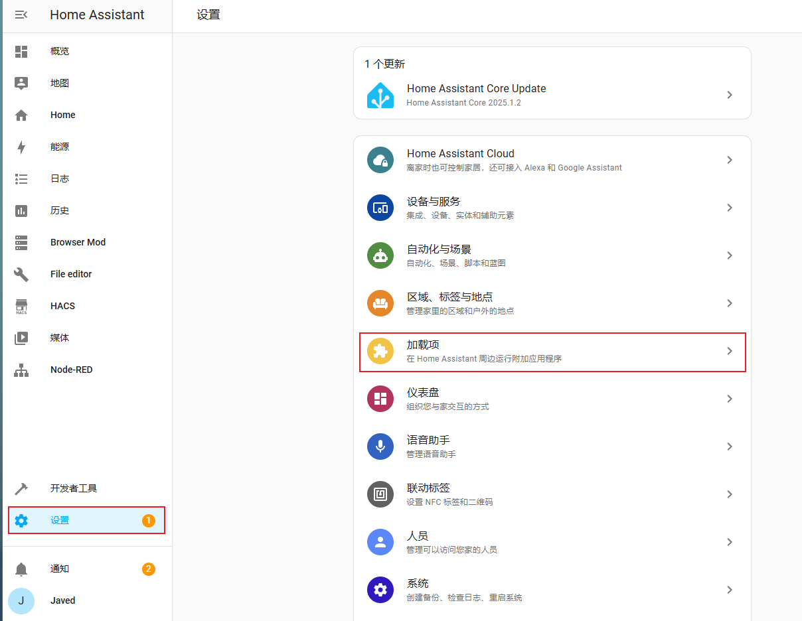

2. 点击加载项商店  
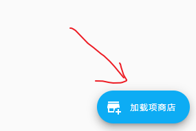

3. 右上角点击仓库  
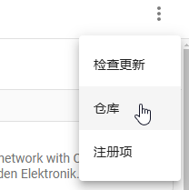

4. 将git项目地址写入对话框，点击添加  
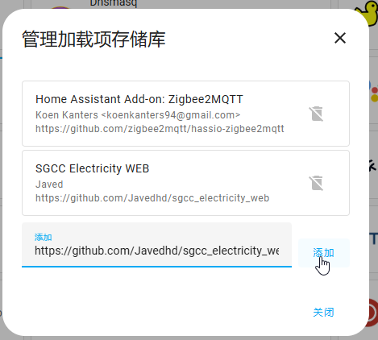

5. 右上角点击检查更新  
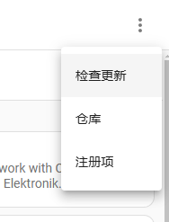

6. 向下滑动，找到sgcc electricity web端  
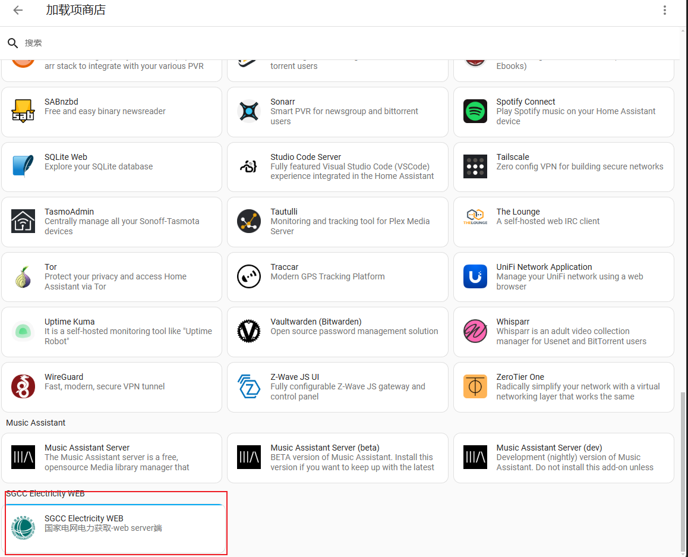

7. 点击安装，等待安装完成  
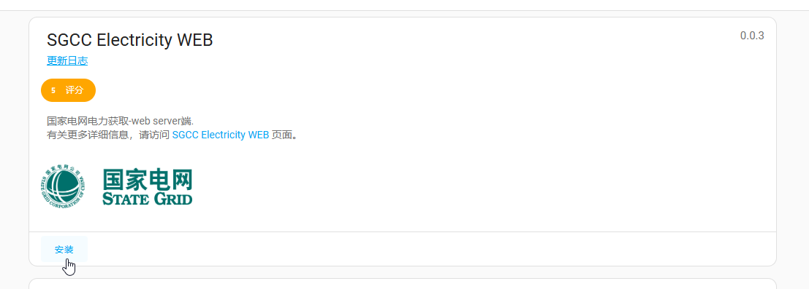

8. 修改配置文件中的手机号与密码  
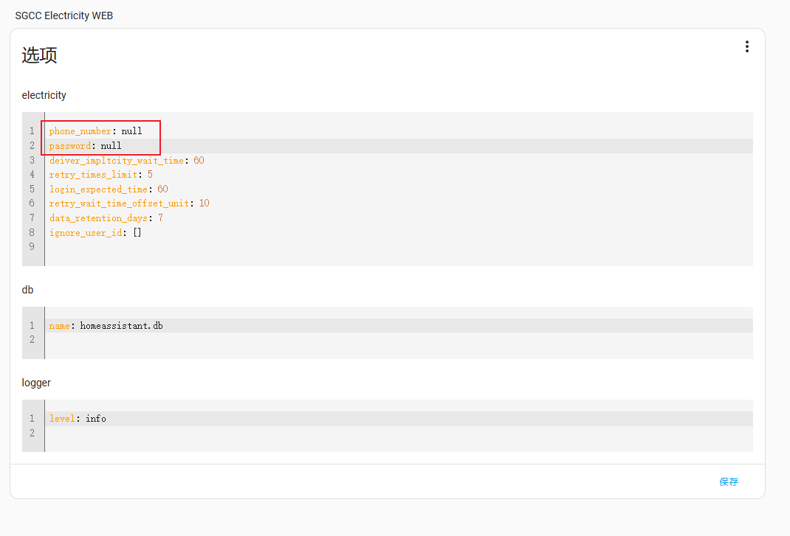

9. 点击启动  
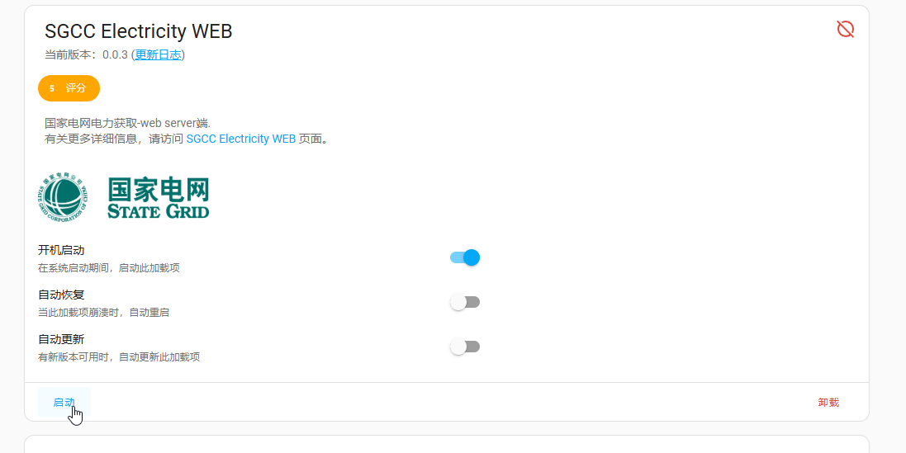

10. 从日志中查看启动情况  
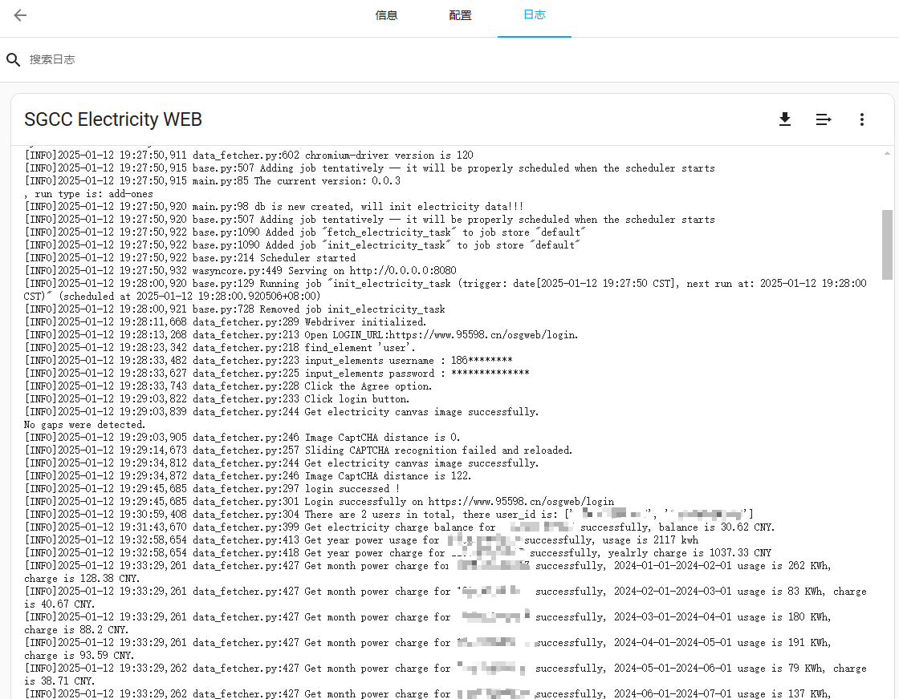

11. 启动成功之后的宿主名就是host名称，在HomeAssistant中通过 http://host:8080即可调用  
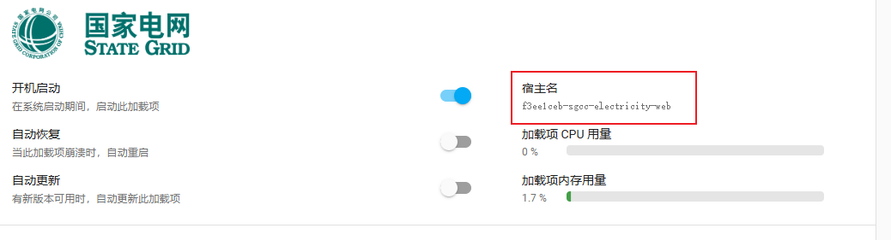

12. 如需配置client端，如下图配置即可  
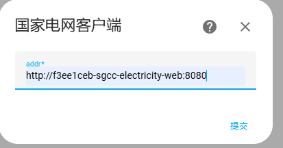