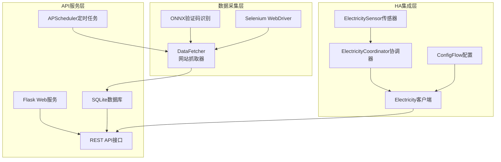

# 网站数据抓取到Home Assistant实体转换完整开发指南

## 📋 文档概述

本文档详细阐述了如何将网站抓取的数据转换为Home Assistant传感器实体的完整技术架构和实现方法。基于国家电网电费监控系统的成功实践，提供可复用的开发框架和详细的实施指南。

## 🏗️ 整体架构设计

### 三层架构模式

```
┌─────────────────────────────────┐
│        第三层：HA集成层          │
│    (Home Assistant Integration) │
├─────────────────────────────────┤
│        第二层：API服务层         │
│       (REST API Service)       │
├─────────────────────────────────┤
│        第一层：数据采集层        │
│      (Web Scraping Layer)      │
└─────────────────────────────────┘
```

### 核心组件关系图



## 🔄 数据流转的15个关键步骤

### 第一阶段：数据采集与存储

#### 步骤1：定时任务触发抓取
```python
# main.py - 定时任务配置
@scheduler.task('cron', id='fetch_electricity_task', 
                hour=config.electricity['cron_hour'], 
                misfire_grace_time=900)
def fetch_electricity_task():
    """
    定时执行数据抓取任务
    - 默认每天7点和19点执行
    - 容错时间15分钟
    """
    try:
        data = fetcher.fetch()  # 触发数据抓取
        # 处理抓取结果...
    except Exception as e:
        logging.error(f"抓取任务失败: {e}")
```

#### 步骤2：网站自动化抓取
```python
# data_fetcher.py - 核心抓取逻辑
class DataFetcher:
    def __init__(self, username: str, password: str):
        self._username = username
        self._password = password
        # 初始化验证码识别模型
        self.onnx = ONNX(captcha_model_path)
    
    def fetch(self):
        """主要抓取入口"""
        driver = self._get_webdriver()
        try:
            # 登录网站
            if self._login(driver):
                # 获取用户列表
                user_id_list = self._get_user_ids(driver)
                
                data = {}
                for userid_index, user_id in enumerate(user_id_list):
                    # 抓取每个用户的数据
                    balance, yearly_usage, yearly_charge, month_data = \
                        self._get_all_data(driver, user_id, userid_index)
                    
                    # 组织数据结构
                    data[user_id] = {
                        'balance': balance,
                        'yearly': {'usage': yearly_usage, 'charge': yearly_charge},
                        'month': month_data,
                        'location': user_location
                    }
                
                return data
        finally:
            driver.quit()
```

#### 步骤3：验证码自动识别
```python
# data_fetcher.py - 验证码处理
def _login(self, driver):
    """登录流程包含验证码识别"""
    # 输入用户名密码
    input_elements[0].send_keys(self._username)
    input_elements[1].send_keys(self._password)
    
    # 点击登录按钮
    self._click_button(driver, By.CLASS_NAME, "el-button.el-button--primary")
    
    # 处理滑动验证码
    for retry_times in range(1, self.RETRY_TIMES_LIMIT + 1):
        # 获取验证码图片
        background_JS = 'return document.getElementById("slideVerify").childNodes[0].toDataURL("image/png");'
        im_info = driver.execute_script(background_JS)
        background_image = base64_to_PLI(im_info.split(',')[1])
        
        # ONNX模型识别距离
        distance = self.onnx.get_distance(background_image)
        
        # 模拟人工滑动
        self._sliding_track(driver, round(distance * 1.06))
        
        # 验证登录结果
        if driver.current_url != LOGIN_URL:
            return True  # 登录成功
```

#### 步骤4：数据存储到数据库
```python
# main.py - 数据入库处理
def fetch_electricity_task():
    data = fetcher.fetch()
    
    for user_id in data.keys():
        user_data = data[user_id]
        
        # 存储余额信息
        if user_data['balance'] is not None:
            electricity.insert_balance_info(user_id, user_data['balance'])
        
        # 存储位置信息
        if user_data['location'] is not None:
            electricity.insert_location_info(user_id, user_data['location'])
        
        # 存储年度数据
        if user_data['yearly'] is not None:
            electricity.insert_year_info(
                user_id, 
                str(datetime.now().year) + '-01-01',
                user_data['yearly']['usage'], 
                user_data['yearly']['charge']
            )
        
        # 存储月度数据
        if user_data['month'] is not None:
            for item in user_data['month']:
                electricity.insert_month_info(
                    user_id, 
                    item['date'][0:7] + '-01',
                    item['usage'], 
                    item['charge']
                )
```

### 第二阶段：REST API服务

#### 步骤5：数据库模型设计
```python
# models/electricity.py - 数据访问层
class Electricity:
    def _init_tables(self):
        """初始化数据库表结构"""
        
        # 用户信息表
        if not self._table_exists('user_info'):
            sql = """
            CREATE TABLE user_info (
                user_code TEXT PRIMARY KEY NOT NULL,
                location TEXT,
                balance REAL NOT NULL,
                create_time DATE NOT NULL DEFAULT CURRENT_TIMESTAMP,
                update_time DATE NOT NULL DEFAULT CURRENT_TIMESTAMP
            );
            """
            cursor.execute(sql)
        
        # 日用电量表
        if not self._table_exists('daily'):
            sql = """
            CREATE TABLE daily (
                user_code TEXT NOT NULL,
                date DATE NOT NULL,
                usage REAL NOT NULL,
                create_time DATE NOT NULL DEFAULT CURRENT_TIMESTAMP,
                update_time DATE NOT NULL DEFAULT CURRENT_TIMESTAMP,
                PRIMARY KEY(user_code, date)
            );
            """
            cursor.execute(sql)
        
        # 月度数据表
        if not self._table_exists('month'):
            sql = """
            CREATE TABLE month (
                user_code TEXT NOT NULL,
                date DATE NOT NULL,
                usage REAL NOT NULL,
                charge REAL NOT NULL,
                create_time DATE NOT NULL DEFAULT CURRENT_TIMESTAMP,
                update_time DATE NOT NULL DEFAULT CURRENT_TIMESTAMP,
                PRIMARY KEY(user_code, date)
            );
            """
            cursor.execute(sql)
        
        # 年度数据表
        if not self._table_exists('year'):
            sql = """
            CREATE TABLE year (
                user_code TEXT NOT NULL,
                date DATE NOT NULL,
                usage REAL NOT NULL,
                charge REAL NOT NULL,
                create_time DATE NOT NULL DEFAULT CURRENT_TIMESTAMP,
                update_time DATE NOT NULL DEFAULT CURRENT_TIMESTAMP,
                PRIMARY KEY(user_code, date)
            );
            """
            cursor.execute(sql)
```

#### 步骤6：API接口实现
```python
# v1/api/electricity_user_list.py - 用户列表API
class ElectricityUserList(Resource):
    def get(self):
        """获取所有用户列表"""
        result = electricity.get_user_list()
        return result, 200, None

# v1/api/electricity_balance_userId.py - 用户余额API
class ElectricityBalanceUserid(Resource):
    def get(self, userId):
        """获取指定用户的余额信息"""
        result = electricity.get_user_balance(userId)
        # 返回格式: {"balance": 123.45, "updateTime": "2024-01-15 08:00:00"}
        return result, 200, None

# v1/api/electricity_this_year_userId.py - 年度数据API
class ElectricityThisYearUserid(Resource):
    def get(self, userId):
        """获取指定用户的年度用电数据"""
        result = electricity.get_user_this_year(userId)
        # 返回格式: {"date": "2024-01-01", "usage": 1500.0, "charge": 800.0}
        return result, 200, None

# v1/api/electricity_latest_month_userId.py - 月度数据API
class ElectricityLatestMonthUserid(Resource):
    def get(self, userId):
        """获取指定用户的最新月度数据"""
        result = electricity.get_user_latest_month(userId)
        # 返回格式: {"date": "2024-01-01", "usage": 120.0, "charge": 65.0}
        return result, 200, None
```

#### 步骤7：路由配置
```python
# v1/routes.py - API路由配置
routes = [
    dict(resource=ElectricityUserList, 
         urls=['/electricity/user_list'], 
         endpoint='electricity_user_list'),
    dict(resource=ElectricityUserInfoUserid, 
         urls=['/electricity/user_info/<userId>'], 
         endpoint='electricity_user_info_userId'),
    dict(resource=ElectricityBalanceUserid, 
         urls=['/electricity/balance/<userId>'], 
         endpoint='electricity_balance_userId'),
    dict(resource=ElectricityDailysUserid, 
         urls=['/electricity/dailys/<userId>'], 
         endpoint='electricity_dailys_userId'),
    dict(resource=ElectricityLatestMonthUserid, 
         urls=['/electricity/latest_month/<userId>'], 
         endpoint='electricity_latest_month_userId'),
    dict(resource=ElectricityThisYearUserid, 
         urls=['/electricity/this_year/<userId>'], 
         endpoint='electricity_this_year_userId'),
]

# main.py - 路由注册
app.register_blueprint(v1.bp, url_prefix='/v1')
```

### 第三阶段：Home Assistant集成

#### 步骤8：集成入口配置
```python
# __init__.py - HA集成入口点
async def async_setup_entry(hass: HomeAssistant, config_entry: ConfigEntry) -> bool:
    """设置Home Assistant集成"""
    
    # 从存储中加载历史数据
    data = await async_load_from_store(hass, CONFIG_NAME) or None
    
    # 获取配置的服务器地址
    addr = config_entry.data["addr"]  # 例如: http://192.168.1.21:8080
    
    # 创建HTTP会话
    session = async_create_clientsession(hass)
    
    # 创建Electricity客户端实例并存储到hass.data
    hass.data[DOMAIN] = Electricity(hass, session, addr, data)
    
    # 异步设置传感器平台
    hass.async_create_task(
        hass.config_entries.async_forward_entry_setups(
            config_entry, [Platform.SENSOR]
        )
    )
    
    return True
```

#### 步骤9：用户配置流程
```python
# config_flow.py - 配置流程处理
class ConfigFlow(config_entries.ConfigFlow, domain=DOMAIN):
    """处理用户配置流程"""
    
    async def async_step_user(self, user_input: dict[str, Any] | None = None) -> FlowResult:
        """处理用户输入步骤"""
        errors: dict[str, str] = {}
        
        if user_input is not None:
            # 检查是否已经配置过相同地址
            entries = self.hass.config_entries.async_entries(DOMAIN)
            for entity in entries:
                if user_input["addr"] == entity.data["addr"]:
                    return self.async_abort(reason="already_configured")
            
            try:
                # 验证用户输入
                info = await validate_input(self.hass, user_input)
            except CannotConnect:
                errors["base"] = "cannot_connect"
            except NoUser:
                errors["base"] = "no_user"  
            except InvalidFormat:
                errors["base"] = "invalid_format"
            except Exception:
                errors["base"] = "unknown"
            else:
                # 创建配置条目
                return self.async_create_entry(title=info["title"], data=user_input)
        
        # 显示配置表单
        return self.async_show_form(
            step_id="user", 
            data_schema=STEP_ADDR_DATA_SCHEMA, 
            errors=errors
        )

async def validate_input(hass: HomeAssistant, data: dict[str, Any]) -> dict[str, Any]:
    """验证用户输入的服务器地址"""
    session = async_get_clientsession(hass)
    addr = data["addr"]
    
    # 验证地址格式
    pattern = r'https?://([^/]+)?:(\d+)?'
    match = re.match(pattern, addr)
    if not match:
        raise InvalidFormat
    
    # 测试连接并获取用户列表
    electricity = Electricity(hass, session, addr, None)
    try:
        user_list = await electricity.async_get_user_list()
        if len(user_list) == 0:
            raise NoUser
    except RequestException:
        raise CannotConnect
    
    return {"title": "服务器地址：" + addr}
```

#### 步骤10：API客户端实现
```python
# electricity.py - API客户端核心逻辑
class Electricity:
    def __init__(self, hass, session, addr, data=None):
        self._hass = hass
        self._session = session
        self._addr = addr  # API服务器地址
        self._user_list = []
        self._data = {} if data is None else data
    
    async def async_get_user_list(self):
        """获取用户列表"""
        url = USER_LIST_URL.format(addr=self._addr)
        # API调用: GET http://192.168.1.21:8080/v1/electricity/user_list
        
        r = await self._session.get(url, timeout=10)
        result = []
        if r.status == 200:
            result = json.loads(await r.read())
        
        self._user_list = result
        return result
    
    async def async_get_balance(self, user_id):
        """获取用户余额信息"""
        url = BALANCE_URL.format(addr=self._addr, user_id=user_id)
        # API调用: GET http://192.168.1.21:8080/v1/electricity/balance/12345
        
        try:
            r = await self._session.get(url, timeout=10)
            if r.status == 200:
                result = json.loads(await r.read())
                # API响应: {"balance": 123.45, "updateTime": "2024-01-15 08:00:00"}
                
                # 数据映射到内部结构
                self._data[user_id]["balance"] = result.get('balance', 0)
                self._data[user_id]["refresh_time"] = result.get('updateTime', 'unknown')
            else:
                LOGGER.warning(f"Balance API failed for {user_id}: HTTP {r.status}")
                self._data[user_id]["balance"] = None
                self._data[user_id]["refresh_time"] = 'unavailable'
        except Exception as e:
            LOGGER.error(f"Balance API error for {user_id}: {e}")
            self._data[user_id]["balance"] = None
            self._data[user_id]["refresh_time"] = 'error'
    
    async def async_get_latest_month(self, user_id):
        """获取最新月度数据"""
        url = LATEST_MONTH_URL.format(addr=self._addr, user_id=user_id)
        # API调用: GET http://192.168.1.21:8080/v1/electricity/latest_month/12345
        
        try:
            r = await self._session.get(url, timeout=10)
            if r.status == 200:
                result = json.loads(await r.read())
                # API响应: {"date": "2024-01-01", "usage": 120.0, "charge": 65.0}
                
                # 数据映射
                self._data[user_id]["last_month_ele_num"] = result.get("usage", 0)
                self._data[user_id]["last_month_ele_cost"] = result.get("charge", 0)
            else:
                LOGGER.warning(f"Latest month API failed for {user_id}: HTTP {r.status}")
                self._data[user_id]["last_month_ele_num"] = None
                self._data[user_id]["last_month_ele_cost"] = None
        except Exception as e:
            LOGGER.error(f"Latest month API error for {user_id}: {e}")
            self._data[user_id]["last_month_ele_num"] = None
            self._data[user_id]["last_month_ele_cost"] = None
    
    async def async_get_this_year(self, user_id):
        """获取年度数据"""
        url = THIS_YEAR_URL.format(addr=self._addr, user_id=user_id)
        # API调用: GET http://192.168.1.21:8080/v1/electricity/this_year/12345
        
        try:
            r = await self._session.get(url, timeout=10)
            if r.status == 200:
                result = json.loads(await r.read())
                # API响应: {"date": "2024-01-01", "usage": 1500.0, "charge": 800.0}
                
                # 数据映射
                self._data[user_id]["year_ele_num"] = result.get("usage", 0)
                self._data[user_id]["year_ele_cost"] = result.get("charge", 0)
            else:
                LOGGER.warning(f"This year API failed for {user_id}: HTTP {r.status}")
                self._data[user_id]["year_ele_num"] = None
                self._data[user_id]["year_ele_cost"] = None
        except Exception as e:
            LOGGER.error(f"This year API error for {user_id}: {e}")
            self._data[user_id]["year_ele_num"] = None
            self._data[user_id]["year_ele_cost"] = None
    
    async def async_get_data(self):
        """获取所有数据的主入口"""
        try:
            # 首先获取用户列表
            user_list = await self.async_get_user_list()
            LOGGER.debug(f"user_list: {user_list}")
            
            # 为每个用户获取详细数据
            for user_id in user_list:
                if user_id not in self._data:
                    # 初始化完整的数据结构
                    self._data[user_id] = {
                        "balance": None,
                        "year_ele_num": None,
                        "year_ele_cost": None,
                        "last_month_ele_num": None,
                        "last_month_ele_cost": None,
                        "refresh_time": None,
                        "dailys": []
                    }
                
                # 分别处理每个API调用，避免一个失败影响全部
                await self.async_get_balance(user_id)
                await self.async_get_latest_month(user_id)
                await self.async_get_this_year(user_id)
            
            # 保存数据到本地存储
            await async_save_to_store(self._hass, CONFIG_NAME, self._data)
            
            LOGGER.debug(f"Final data structure: {json.dumps(self._data)}")
            
        except Exception as err:
            LOGGER.error(f"get data error: {err}")
            
        return self._data
```

#### 步骤11：数据协调器实现
```python
# coordinator.py - 数据更新协调器
class ElectricityCoordinator(DataUpdateCoordinator):
    """负责管理数据更新周期和缓存"""
    
    def __init__(self, hass: HomeAssistant) -> None:
        super().__init__(
            hass,
            LOGGER,
            name=DOMAIN,
            update_interval=timedelta(seconds=300)  # 5分钟更新一次
        )
        self.first_setup = True
        self.electricity: Electricity = hass.data[DOMAIN]
    
    async def _async_update_data(self):
        """定时更新数据的核心方法"""
        # 调用Electricity客户端获取最新数据
        await self.electricity.async_get_data()
        self.first_setup = False
        
        # 返回完整的数据结构供传感器使用
        return self.electricity.get_data()
        
        # 返回的数据结构示例:
        # {
        #     "12345": {
        #         "balance": 158.32,
        #         "year_ele_num": 1245.6,
        #         "year_ele_cost": 687.23,
        #         "last_month_ele_num": 120.0,
        #         "last_month_ele_cost": 65.0,
        #         "refresh_time": "2024-01-15 07:00:00",
        #         "dailys": []
        #     },
        #     "67890": {
        #         // 另一个用户的数据...
        #     }
        # }
```

#### 步骤12：传感器类型定义
```python
# sensor.py - 传感器类型配置
SENSOR_TYPES = [
    {
        "key": "balance",
        "name": "账户余额",
        "native_unit_of_measurement": UNIT_YUAN,
        "device_class": SensorDeviceClass.MONETARY,
        "state_class": SensorStateClass.TOTAL
    },
    {
        "key": "year_ele_num",
        "name": "年度累计用电",
        "native_unit_of_measurement": UnitOfEnergy.KILO_WATT_HOUR,
        "device_class": SensorDeviceClass.ENERGY,
        "state_class": SensorStateClass.TOTAL
    },
    {
        "key": "year_ele_cost",
        "name": "年度累计电费",
        "native_unit_of_measurement": UNIT_YUAN,
        "device_class": SensorDeviceClass.MONETARY,
        "state_class": SensorStateClass.TOTAL
    },
    {
        "key": "last_month_ele_num",
        "name": "上个月用电",
        "native_unit_of_measurement": UnitOfEnergy.KILO_WATT_HOUR,
        "device_class": SensorDeviceClass.ENERGY,
        "state_class": SensorStateClass.TOTAL
    },
    {
        "key": "last_month_ele_cost",
        "name": "上个月电费",
        "native_unit_of_measurement": UNIT_YUAN,
        "device_class": SensorDeviceClass.MONETARY,
        "state_class": SensorStateClass.TOTAL
    },
    {
        "key": "refresh_time",
        "name": "最近刷新时间"
        # 时间类型传感器不需要单位和设备类别
    }
]
```

#### 步骤13：传感器平台设置
```python
# sensor.py - 传感器平台入口
async def async_setup_entry(
    hass: HomeAssistant, 
    entry: ConfigEntry, 
    async_add_entities: AddEntitiesCallback
) -> None:
    """设置传感器平台"""
    
    # 创建数据协调器
    coordinator = ElectricityCoordinator(hass)
    
    # 首次刷新数据
    await coordinator.async_config_entry_first_refresh()
    
    # 为每个用户创建所有类型的传感器实体
    entities = []
    for user_id in coordinator.data.keys():
        for sensor_type in SENSOR_TYPES:
            entities.append(
                ElectricitySensor(user_id, sensor_type, entry.entry_id, coordinator)
            )
    
    # 批量添加实体到Home Assistant
    async_add_entities(entities)
    
    # 创建的实体示例 (假设有用户12345和67890):
    # sensor.electricity_12345_balance          - 用户12345的账户余额
    # sensor.electricity_12345_year_ele_num     - 用户12345的年度用电
    # sensor.electricity_12345_year_ele_cost    - 用户12345的年度电费
    # sensor.electricity_12345_last_month_ele_num   - 用户12345的上月用电
    # sensor.electricity_12345_last_month_ele_cost  - 用户12345的上月电费
    # sensor.electricity_12345_refresh_time     - 用户12345的刷新时间
    # sensor.electricity_67890_balance          - 用户67890的账户余额
    # ... (用户67890的其他传感器)
```

#### 步骤14：传感器实体实现
```python
# sensor.py - 传感器实体类
class ElectricitySensor(CoordinatorEntity[ElectricityCoordinator], SensorEntity):
    """电费传感器实体"""
    
    _attr_has_entity_name = True
    
    def __init__(
        self, 
        user_id: str, 
        sensor_type: dict, 
        entry_id: str, 
        coordinator: ElectricityCoordinator
    ) -> None:
        super().__init__(coordinator)
        
        # 基本属性设置
        self.user_id = user_id
        self.sensor_type = sensor_type
        
        # 生成唯一的实体ID
        self.entity_id = SENSOR_DOMAIN + ".electricity" + "_" + user_id + "_" + sensor_type["key"]
        # 例如: sensor.electricity_12345_balance
        
        # 设置显示名称
        self._attr_name = sensor_type["name"]
        # 例如: "账户余额"
        
        # 生成唯一标识符
        self._attr_unique_id = entry_id + "-" + user_id + "-" + sensor_type["key"]
        # 例如: "config_entry_id-12345-balance"
        
        # 设置传感器设备类别
        if "device_class" in sensor_type:
            self._attr_device_class = sensor_type["device_class"]
            # 例如: SensorDeviceClass.MONETARY (货币类型)
        
        # 设置状态类别
        if "state_class" in sensor_type:
            self._attr_state_class = sensor_type["state_class"]
            # 例如: SensorStateClass.TOTAL (总量类型)
        
        # 设置测量单位
        if "native_unit_of_measurement" in sensor_type:
            self._attr_native_unit_of_measurement = sensor_type["native_unit_of_measurement"]
            # 例如: "元" 或 "kWh"
        
        # 设置设备信息 - 同一用户的所有传感器归属于同一设备
        self._attr_device_info = {
            "name": user_id,                           # 设备名称
            "identifiers": {(DOMAIN, user_id)},        # 设备标识符
            "sw_version": VERSION,                     # 软件版本
            "manufacturer": "Javed",                   # 制造商
            "model": "户号：" + user_id                # 设备型号
        }
    
    @property
    def native_value(self):
        """获取传感器的当前值"""
        # 从协调器数据中获取对应用户和传感器类型的值
        data = self.coordinator.data[self.user_id]
        value = data[self.sensor_type["key"]]
        
        # 数据获取示例:
        # self.coordinator.data["12345"]["balance"] -> 158.32
        # self.coordinator.data["12345"]["year_ele_num"] -> 1245.6
        # self.coordinator.data["12345"]["refresh_time"] -> "2024-01-15 07:00:00"
        
        return value
    
    @property
    def available(self) -> bool:
        """传感器是否可用"""
        # 检查协调器是否可用且数据中包含该用户
        return (
            self.coordinator.last_update_success and 
            self.user_id in self.coordinator.data
        )
    
    @property
    def extra_state_attributes(self):
        """额外的状态属性"""
        attributes = {}
        
        # 添加用户ID作为属性
        attributes["user_id"] = self.user_id
        
        # 为余额传感器添加更新时间
        if self.sensor_type["key"] == "balance":
            user_data = self.coordinator.data.get(self.user_id, {})
            if "refresh_time" in user_data:
                attributes["last_updated"] = user_data["refresh_time"]
        
        return attributes
```

#### 步骤15：最终实体状态展示
```python
# 在Home Assistant中的最终实体状态示例

# 实体: sensor.electricity_12345_balance
{
    "entity_id": "sensor.electricity_12345_balance",
    "state": "158.32",
    "attributes": {
        "unit_of_measurement": "元",
        "device_class": "monetary",
        "state_class": "total",
        "friendly_name": "账户余额",
        "user_id": "12345",
        "last_updated": "2024-01-15 07:00:00"
    },
    "last_changed": "2024-01-15T07:05:00.000Z",
    "last_updated": "2024-01-15T07:05:00.000Z"
}

# 实体: sensor.electricity_12345_year_ele_num  
{
    "entity_id": "sensor.electricity_12345_year_ele_num",
    "state": "1245.6",
    "attributes": {
        "unit_of_measurement": "kWh",
        "device_class": "energy", 
        "state_class": "total",
        "friendly_name": "年度累计用电",
        "user_id": "12345"
    },
    "last_changed": "2024-01-15T07:05:00.000Z",
    "last_updated": "2024-01-15T07:05:00.000Z"
}

# 实体: sensor.electricity_12345_refresh_time
{
    "entity_id": "sensor.electricity_12345_refresh_time", 
    "state": "2024-01-15 07:00:00",
    "attributes": {
        "friendly_name": "最近刷新时间",
        "user_id": "12345"
    },
    "last_changed": "2024-01-15T07:05:00.000Z",
    "last_updated": "2024-01-15T07:05:00.000Z"
}
```

## 🔍 完整数据流转示例

### 示例场景：用户"12345"的数据完整流转

#### 原始抓取数据
```python
# DataFetcher.fetch() 从网站抓取返回
{
    "12345": {
        "balance": 158.32,
        "location": "北京市朝阳区", 
        "yearly": {"usage": 1245.6, "charge": 687.23},
        "month": [
            {"date": "2024-01", "usage": 120.0, "charge": 65.0},
            {"date": "2023-12", "usage": 135.2, "charge": 72.8}
        ],
        "daily": [
            {"date": "2024-01-15", "usage": 4.5},
            {"date": "2024-01-14", "usage": 3.8}
        ]
    }
}
```

#### 数据库存储结果
```sql
-- user_info表
INSERT INTO user_info VALUES ('12345', '北京市朝阳区', 158.32, '2024-01-15 07:00:00', '2024-01-15 07:00:00');

-- year表  
INSERT INTO year VALUES ('12345', '2024-01-01', 1245.6, 687.23, '2024-01-15 07:00:00', '2024-01-15 07:00:00');

-- month表
INSERT INTO month VALUES ('12345', '2024-01-01', 120.0, 65.0, '2024-01-15 07:00:00', '2024-01-15 07:00:00');
INSERT INTO month VALUES ('12345', '2023-12-01', 135.2, 72.8, '2024-01-15 07:00:00', '2024-01-15 07:00:00');

-- daily表
INSERT INTO daily VALUES ('12345', '2024-01-15', 4.5, '2024-01-15 07:00:00', '2024-01-15 07:00:00');
INSERT INTO daily VALUES ('12345', '2024-01-14', 3.8, '2024-01-15 07:00:00', '2024-01-15 07:00:00');
```

#### API接口响应
```http
# 获取用户列表
GET http://192.168.1.21:8080/v1/electricity/user_list
Response: ["12345", "67890"]

# 获取用户余额
GET http://192.168.1.21:8080/v1/electricity/balance/12345
Response: {
    "balance": 158.32,
    "updateTime": "2024-01-15 07:00:00"
}

# 获取年度数据
GET http://192.168.1.21:8080/v1/electricity/this_year/12345
Response: {
    "date": "2024-01-01",
    "usage": 1245.6,
    "charge": 687.23
}

# 获取最新月度数据
GET http://192.168.1.21:8080/v1/electricity/latest_month/12345
Response: {
    "date": "2024-01-01", 
    "usage": 120.0,
    "charge": 65.0
}
```

#### HA集成数据结构
```python
# Electricity.async_get_data() 整合后的数据结构
{
    "12345": {
        "balance": 158.32,
        "year_ele_num": 1245.6,
        "year_ele_cost": 687.23,
        "last_month_ele_num": 120.0,
        "last_month_ele_cost": 65.0,
        "refresh_time": "2024-01-15 07:00:00",
        "dailys": []
    }
}
```

#### 协调器数据缓存
```python
# ElectricityCoordinator.data (每5分钟更新一次)
coordinator.data = {
    "12345": {
        "balance": 158.32,
        "year_ele_num": 1245.6, 
        "year_ele_cost": 687.23,
        "last_month_ele_num": 120.0,
        "last_month_ele_cost": 65.0,
        "refresh_time": "2024-01-15 07:00:00",
        "dailys": []
    }
}
```

#### 创建的传感器实体
```python
# 为用户12345创建的6个传感器实体
entities = [
    "sensor.electricity_12345_balance",          # 状态: 158.32
    "sensor.electricity_12345_year_ele_num",     # 状态: 1245.6  
    "sensor.electricity_12345_year_ele_cost",    # 状态: 687.23
    "sensor.electricity_12345_last_month_ele_num",   # 状态: 120.0
    "sensor.electricity_12345_last_month_ele_cost",  # 状态: 65.0
    "sensor.electricity_12345_refresh_time"      # 状态: "2024-01-15 07:00:00"
]
```

#### Home Assistant设备展示
```yaml
# 在HA中显示为一个设备，包含6个传感器实体
device:
  name: "12345"
  manufacturer: "Javed"
  model: "户号：12345"
  identifiers: ["sgcc_electricity_client", "12345"]
  
  entities:
    - sensor.electricity_12345_balance: "158.32 元"
    - sensor.electricity_12345_year_ele_num: "1245.6 kWh"
    - sensor.electricity_12345_year_ele_cost: "687.23 元" 
    - sensor.electricity_12345_last_month_ele_num: "120.0 kWh"
    - sensor.electricity_12345_last_month_ele_cost: "65.0 元"
    - sensor.electricity_12345_refresh_time: "2024-01-15 07:00:00"
```

## 🛠️ 复用开发模板

### Web抓取层模板
```python
# 模板: custom_data_fetcher.py
class CustomDataFetcher:
    def __init__(self, username: str, password: str):
        self._username = username
        self._password = password
        # TODO: 初始化特定网站需要的组件
    
    def fetch(self):
        """主要抓取入口 - 需要根据目标网站定制"""
        driver = self._get_webdriver()
        try:
            if self._login(driver):
                # TODO: 实现特定的数据抓取逻辑
                data = self._extract_data(driver)
                return data
        finally:
            driver.quit()
    
    def _login(self, driver):
        """登录逻辑 - 需要根据目标网站定制"""
        # TODO: 实现特定网站的登录流程
        pass
    
    def _extract_data(self, driver):
        """数据提取 - 需要根据目标网站定制"""  
        # TODO: 实现特定的数据提取逻辑
        pass
```

### API服务层模板
```python
# 模板: models/custom_data.py
class CustomData:
    def _init_tables(self):
        """数据库表初始化 - 需要根据数据结构定制"""
        # TODO: 创建适合目标数据的表结构
        pass
    
    def get_user_list(self):
        """获取用户列表 - 通用逻辑"""
        # TODO: 根据实际表结构调整查询语句
        pass
    
    def get_user_data(self, user_id, data_type):
        """获取用户数据 - 需要根据数据类型定制"""
        # TODO: 实现特定数据类型的查询逻辑
        pass

# 模板: v1/api/custom_api.py  
class CustomDataAPI(Resource):
    def get(self, user_id):
        """API接口 - 需要根据数据类型定制"""
        # TODO: 调用数据模型获取数据并返回
        result = custom_data.get_user_data(user_id, 'specific_type')
        return result, 200, None
```

### HA集成层模板
```python
# 模板: custom_client.py
class CustomClient:
    def __init__(self, hass, session, addr, data=None):
        self._hass = hass
        self._session = session
        self._addr = addr
        self._data = {} if data is None else data
    
    async def async_get_data(self):
        """获取数据主入口 - 需要根据API接口定制"""
        user_list = await self.async_get_user_list()
        
        for user_id in user_list:
            if user_id not in self._data:
                # TODO: 根据目标数据类型初始化数据结构
                self._data[user_id] = {
                    "field1": None,
                    "field2": None,
                    # 更多字段...
                }
            
            # TODO: 调用各种API获取数据
            await self.async_get_specific_data(user_id)
        
        return self._data
    
    async def async_get_specific_data(self, user_id):
        """获取特定类型数据 - 需要根据API接口定制"""
        # TODO: 实现特定API的调用逻辑
        pass

# 模板: sensor.py
SENSOR_TYPES = [
    {
        "key": "field1",
        "name": "显示名称1",
        "native_unit_of_measurement": "单位1",
        "device_class": "设备类别1",
        "state_class": "状态类别1"
    },
    {
        "key": "field2", 
        "name": "显示名称2",
        "native_unit_of_measurement": "单位2",
        "device_class": "设备类别2",
        "state_class": "状态类别2"
    }
    # TODO: 根据目标数据添加更多传感器类型
]
```

## 📝 开发实施步骤

### 第一步：项目结构创建
```
your_project/
├── web_service/                 # Web抓取服务
│   ├── src/
│   │   ├── main.py             # Flask应用入口
│   │   ├── config.py           # 配置管理
│   │   ├── your_fetcher/       # 抓取模块
│   │   │   ├── data_fetcher.py # 抓取器实现
│   │   │   └── const.py        # 常量定义
│   │   ├── models/             # 数据模型
│   │   │   └── your_data.py    # 数据访问层
│   │   └── v1/                 # API接口
│   │       ├── routes.py       # 路由配置
│   │       └── api/            # API实现
│   ├── requirements.txt        # Python依赖
│   └── docker-compose.yml      # Docker配置
│
└── ha_integration/              # HA集成组件
    └── custom_components/
        └── your_integration/
            ├── __init__.py     # 集成入口
            ├── manifest.json   # 集成清单
            ├── config_flow.py  # 配置流程
            ├── const.py        # 常量定义
            ├── coordinator.py  # 数据协调器
            ├── sensor.py       # 传感器实现
            ├── your_client.py  # API客户端
            └── strings.json    # 多语言支持
```

### 第二步：Web服务开发
1. **实现数据抓取器**
   - 分析目标网站的登录流程
   - 实现自动化登录逻辑
   - 开发数据提取方法
   - 添加错误处理和重试机制

2. **设计数据库模型**
   - 根据抓取数据设计表结构
   - 实现数据访问层(DAO)
   - 添加数据迁移逻辑

3. **开发REST API**
   - 创建API资源类
   - 配置路由映射
   - 实现标准化响应格式

4. **配置定时任务**
   - 设置数据抓取计划
   - 实现任务错误处理
   - 添加日志记录

### 第三步：HA集成开发
1. **创建集成基础**
   - 编写manifest.json
   - 实现集成入口(__init__.py)
   - 配置常量定义

2. **实现配置流程**
   - 开发用户配置界面
   - 添加输入验证逻辑
   - 实现连接测试

3. **开发API客户端**
   - 实现HTTP客户端
   - 添加数据获取方法
   - 处理API错误情况

4. **创建数据协调器**
   - 实现定时更新逻辑
   - 添加数据缓存机制
   - 处理更新失败情况

5. **实现传感器实体**
   - 定义传感器类型
   - 实现传感器类
   - 配置设备信息

### 第四步：测试与部署
1. **单元测试**
   - 测试数据抓取逻辑
   - 验证API接口功能
   - 检查HA集成正确性

2. **集成测试**
   - 端到端数据流测试
   - 错误恢复测试
   - 性能压力测试

3. **部署配置**
   - Docker容器化
   - 环境配置管理
   - 监控和日志设置

## ⚠️ 关键注意事项

### 数据一致性
- 确保抓取数据格式与API响应格式一致
- 统一错误处理和空值处理逻辑
- 保持数据结构在各层间的映射关系

### 性能优化
- 合理设置更新频率，避免过度请求
- 实现数据缓存机制，减少重复查询
- 使用异步操作，避免阻塞主线程

### 错误处理
- 网络请求添加超时和重试机制
- 数据解析添加异常捕获
- API调用失败时提供降级方案

### 安全考虑
- 敏感信息(用户名、密码)加密存储
- API接口添加访问控制
- 避免在日志中记录敏感数据

## 🎯 成功案例参考

通过这个完整的架构，您可以轻松地将任何网站的数据转换为Home Assistant传感器实体。关键是理解每一层的职责和数据流转机制，然后根据具体需求调整实现细节。

这个架构的最大优势是**高度模块化**和**标准化接口**，使得复用变得非常简单和可靠。
